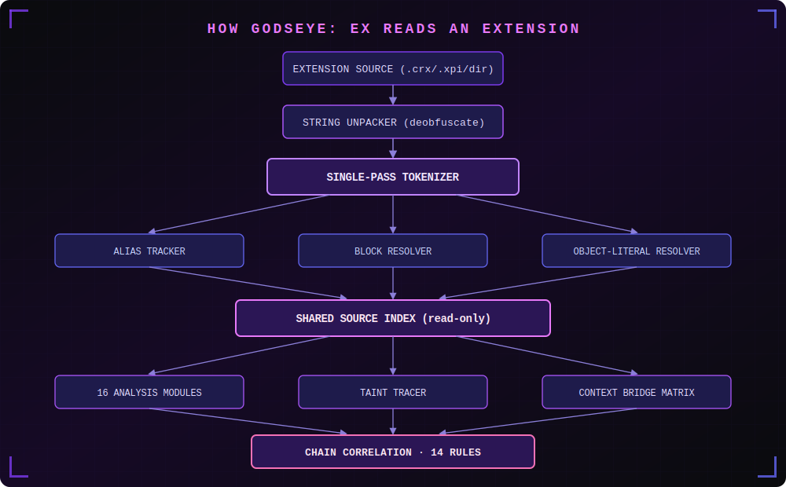
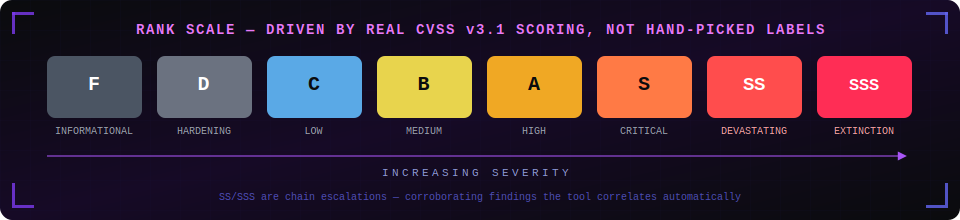

<div align="center">



<br/>

[](https://python.org)
[](docs/extension_security_top10.md)
[](godseye/engine/chains.py)
[](tests/)
[](LICENSE)
[](docs/)

**The only browser extension security scanner with a real single-pass tokenizer,
brace-aware handler-body resolution, intra-block taint tracing, and a cross-context privilege escalation matrix.**

[Installation](#installation) · [Usage](#usage) · [Architecture](#architecture) · [Modules](#modules) · [Chains](#chain-rules)

</div>

---

## What makes this different

Most extension scanners are enhanced `grep`. They fire a pattern, record a line number, move on.
GODSEYE: EX operates on **structure**, not just strings.



| Capability | Other scanners | GODSEYE: EX |
|---|---|---|
| File I/O per module | Every module re-reads files | **One read, shared index** |
| Handler body analysis | Fixed 400-char window (token collision) | **Brace-aware block resolver** |
| Obfuscation resistance | Misses `'\x65\x76\x61\x6c'` | **String unpacker pre-processes first** |
| Alias tracking | Misses `const run = eval; run(data)` | **Alias tracker injects synthetic spans** |
| Source-to-sink tracking | Flags sinks in isolation | **Taint tracer within resolved blocks** |
| Cross-file flows | File-by-file only | **Context bridge matrix (content→background→native)** |
| Vendor noise | Spams findings from jQuery internals | **Vendor detector excludes, supply chain still fingerprints** |

---

## Installation

```bash
git clone https://github.com/rithinkrishnakv/godseye-ex
cd godseye-ex
pip install -e .
```

Requires Python 3.10+. No other runtime dependencies beyond `rich`.

---

## Usage

```bash
# Scan an unpacked extension directory
godseye-ex scan ./my-extension

# Full output: terminal + HTML report + JSON + SARIF for CI
godseye-ex scan ./my-extension --html report.html --json report.json --sarif report.sarif

# Only show B-rank and above (filter out noise)
godseye-ex scan ./my-extension --min-rank B

# Compare two versions — did the update introduce regressions?
godseye-ex diff ./extension-v1/ ./extension-v2/ --html diff.html

# Extension metadata without a full scan
godseye-ex info ./my-extension

# List all 16 modules
godseye-ex list-modules

# Plain output for CI logs / grep
godseye-ex scan ./my-extension --plain
```

**Accepts:** unpacked folder, `.crx`, `.xpi`, `.zip`

**CI gate (GitHub Actions):**
```yaml
- name: GODSEYE: EX scan
  run: godseye-ex scan ./extension --sarif godseye.sarif --fail-on S
- uses: github/codeql-action/upload-sarif@v3
  with:
    sarif_file: godseye.sarif
```

---

## Architecture

### Engine Layer

```
engine/
  loader.py           # Single-pass file reader + AnalysisContext builder
  tokenizer.py        # Rule registry + brace-aware block resolver
  string_unpacker.py  # Pre-processor: hex escapes, concat, bracket notation
  alias_tracker.py    # const safeLog = eval → flags safeLog() calls
  taint_tracer.py     # Source→Sink within resolved handler blocks
  context_bridge.py   # Cross-context privilege escalation matrix
  chains.py           # 14 correlation rules over combined findings
  aggregate.py        # De-duplicates repeated identical hits
  vendor_detect.py    # Heuristic vendor/minified file exclusion
```

### The Four Engines (v3 additions)

**① String Unpacker**
Pre-processes every file before indexing. Expands:
- Hex/unicode escapes: `'\x65\x76\x61\x6c'` → `'eval'`
- String concatenation: `'chr' + 'ome'` → `'chrome'`
- Bracket notation: `window['eval']` → `window.eval`
- Array join patterns: `['\x65','\x76\x61\x6c'].join('')` → `'eval'`

**② Alias Tracker**
Finds dangerous-function assignments and injects synthetic match spans:
```js
const safeLog = eval;     // ← detected: alias to DYN-EVAL
safeLog(untrustedData);   // ← flagged: DYN-EVAL-ALIAS at this line
```

**③ Taint Tracer (intra-block)**
Within each resolved handler body, traces whether data from a known source reaches a dangerous sink without a sanitizer:
```
SOURCE: event.data (postMessage payload)
  ↓  no DOMPurify/textContent/encodeURIComponent between them
SINK: element.innerHTML = ...
→ TAINT-DOM-XSS finding
```

**④ Context Bridge Matrix**
Reads the manifest to classify files by context, then maps message flows:
```
content.js (sends chrome.runtime.sendMessage)
    ↓
background.js (onMessage handler → chrome.scripting.executeScript)
→ BRIDGE-CONTENT-TO-BG escalation path flagged
```

---

## Modules

| # | Module | Type | Category | What it finds |
|---|--------|------|----------|--------------|
| 1 | **Manifest Sight** | PASSIVE | E1/E9 | Permissions, `<all_urls>`, CSP, update integrity |
| 2 | **Manifest Deception Sight** | UNIQUE | E11 | WAR exposure, optional permission ratcheting, permission/code mismatch |
| 3 | **Messaging Sentinel** | ACTIVE | E2 | `onMessage`, `onMessageExternal`, `postMessage` — real body resolution |
| 4 | **Injection Sight** | ACTIVE | E3 | `innerHTML`, `outerHTML`, `document.write`, `insertAdjacentHTML` |
| 5 | **Dynamic Code Sight** | ACTIVE | E4 | `eval`, `new Function`, remote `importScripts`, dynamic `<script>` |
| 6 | **Credential & Storage Sight** | PASSIVE | E5 | Hardcoded secrets, unencrypted `chrome.storage` / `localStorage` |
| 7 | **Supply Chain Sentinel** | HIDDEN | E6 | Remote CDN scripts, known-vulnerable bundled libraries (jQuery, Lodash) |
| 8 | **Native Bridge Sight** | UNIQUE | E7 | `nativeMessaging`, `connectNative`/`sendNativeMessage` |
| 9 | **Privacy Sentinel** | PASSIVE | E8 | Permission combos adding up to surveillance capability |
| 10 | **Hardening Sight** | ACTIVE | E10 | Debug leftovers, security-flagged TODOs, sensitive `console.log` |
| 11 | **Crypto & Entropy Auditor** | UNIQUE | E12 | DES/RC4/3DES, MD5/SHA-1, `Math.random()`, XOR schemes, ECB mode |
| 12 | **Network Policy Auditor** | ACTIVE | E13 | Dynamic `declarativeNetRequest`, header hooks, cleartext HTTP, proxy |
| 13 | **Context Leakage Auditor** | UNIQUE | E14 | `window.X = chrome.*`, `CustomEvent` with privileged data |
| 14 | **Tab Injection Controller** | ACTIVE | E15 | `executeScript` with dynamic targets or code strings |
| 15 | **External CORS Auditor** | ACTIVE | E16 | `Access-Control-Allow-Origin: *`, `no-cors`, `withCredentials` |
| 16 | **Taint Analysis Engine** | UNIQUE | E17 | Source→sink flows + cross-context privilege escalation matrix |

---

## Chain Rules

When individual findings co-occur in patterns that make them collectively worse, GODSEYE: EX escalates them into chain findings. No extra scanning — pure correlation over the 16 modules' output.

| Chain | Signals | Rank |
|-------|---------|------|
| Broad exposure + unvalidated messaging | host_exposure + unvalidated_messaging | **SS** |
| Broad exposure + DOM sink | host_exposure + dom_sink | **SS** |
| WAR exposure + unvalidated messaging | WAR wildcard + unvalidated_messaging | **SS** |
| CSP unsafe-eval + remote code | csp_weak + remote_code | **SS** |
| CSP unsafe-eval + eval in code | csp_weak + dynamic_exec | B |
| externally_connectable wildcard + sensitive permission | extconn_open + sensitive_permission | **SS** |
| Unvalidated messaging + DOM sink (same file) | same-file correlation | B |
| Credential + broad exposure | credential_exposure + host_exposure | **SS** |
| Broken crypto + credential | broken_crypto + credential_exposure | A |
| Math.random + credential | insecure_prng + credential_exposure | A |
| Context leak + DOM sink (same file) | context_leak + dom_sink | **SS** |
| Tab injection + unvalidated messaging | tab_injection + unvalidated_messaging | **SS** |
| Network manipulation + credential | network_manipulation + credential_exposure | **SS** |
| Native bridge + remote code | native_bridge + remote_code | **☠ SSS (Extinction)** |

---

## Rank System

Scores come from real **CVSS v3.1 base score calculation** (FIRST.org formula), not hand-picked labels.



| Rank | CVSS | Class |
|------|------|-------|
| ○ F | 0.0 | Informational |
| ◇ D | < 3.0 | Hardening debt |
| ◆ C | < 5.0 | Needs investigation |
| ▲ B | < 7.0 | Concrete moderate-impact pattern |
| ★ A | < 9.0 | High-impact (single signal) |
| ⚔ S | < 9.5 | Critical (single signal) |
| ⚡ SS | — | Chain: corroborating signals |
| ☠ SSS | — | Extinction: remote code reaches OS-level bridge |

---

## Coverage & Limitations

**Works well on:** readable, unminified JS/HTML with a valid `manifest.json` (MV2 or MV3, Chrome/Edge/Firefox).

**Vendor files:** excluded from pattern scanning by default (`--include-vendor` to override). Supply Chain Sentinel always scans them.

**Taint analysis scope:** intra-block (within a single resolved handler body). Cross-function flows within the same file, and cross-file flows beyond the bridge matrix, are not modelled.

**Obfuscation:** the string unpacker handles the top-5 real-world patterns (hex escapes, concat, bracket notation, array join, unicode escapes). Deeper obfuscation (custom encoding, runtime-only strings) is out of scope.

**A clean scan = "no obvious static red flags", not "proven safe."** Pair with manual review for security-critical extensions.

---

## License

MIT — built for security researchers and extension developers who want to find real bugs before attackers do.

---

<div align="center">
<sub>Built with precision. Finds what grep misses.</sub>
</div>
